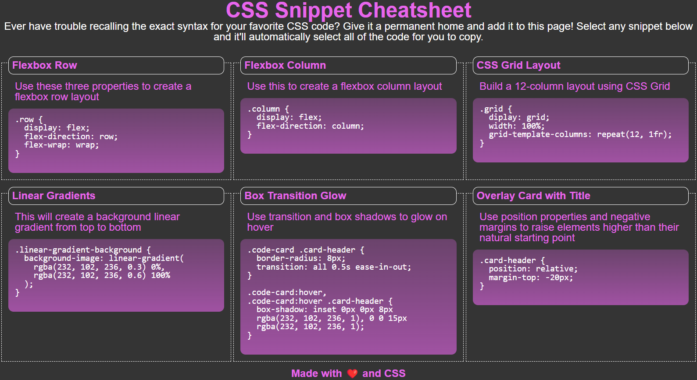

# CSS-Study-Snippets

## Description

Study sheet containing small examples of CSS code presented in a copyable format.  Made to practice various css and html styling techniques.  In particular, this project forcused on the use of the flex display and use of CSS-selectors to highlight elements.  When a code section is clicked on, the entire section will be selected.

Link to Site: [https://adamywfong.github.io/CSS-Study-Snippets/](https://adamywfong.github.io/CSS-Study-Snippets/)

